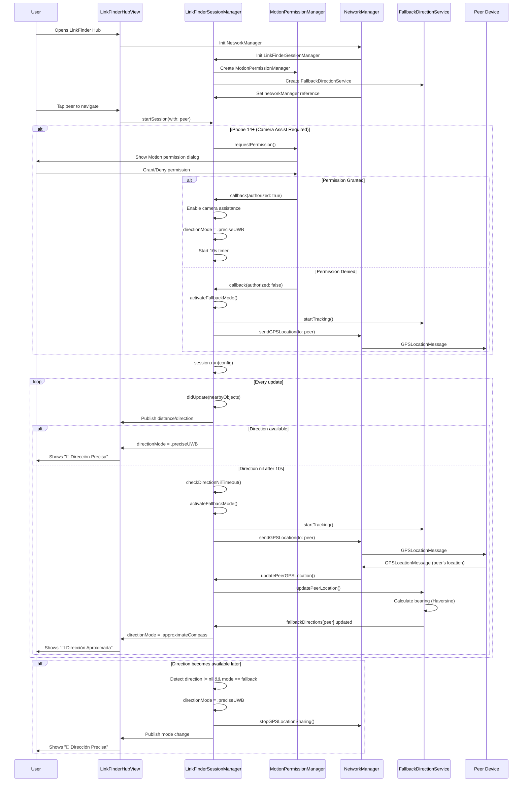

# LinkFinder Fallback Direction System

## 📋 Resumen Ejecutivo

Sistema automático de fallback para medición de dirección en LinkFinder (UWB) que detecta cuando la dirección ARKit no está disponible y cambia transparentemente a un sistema basado en GPS + Compass para mantener la funcionalidad de navegación.

**Problema resuelto:** iPhone 14+ requieren ARKit camera assistance para dirección UWB, pero si CoreMotion está bloqueado o el dispositivo no se mueve lo suficiente, la dirección permanece `nil` indefinidamente. Este sistema detecta esa situación y activa automáticamente un fallback usando GPS + brújula.

**Estado:** ✅ Completamente implementado y compilando
**Fecha:** 13 de octubre de 2025
**Versión iOS:** 14.0+ (LinkFinder), 16.0+ (Algorithm Convergence)

---

## 🎯 Arquitectura del Sistema

### Componentes Principales

```
┌─────────────────────────────────────────────────────────┐
│           LinkFinderSessionManager (Orquestador)        │
│  - Gestiona sesiones NISession                          │
│  - Detecta direction=nil persistente                    │
│  - Activa/desactiva fallback automáticamente            │
│  - @Published directionMode: DirectionMode              │
└─────────────────────────────────────────────────────────┘
                          │
         ┌────────────────┼────────────────┐
         ↓                ↓                ↓
┌──────────────────┐ ┌──────────────┐ ┌──────────────────┐
│MotionPermission  │ │FallbackDir   │ │NetworkManager    │
│Manager           │ │Service       │ │                  │
│- Solicita Motion │ │- Compass     │ │- GPS exchange    │
│- Callback status │ │- GPS bearing │ │- sendGPS()       │
└──────────────────┘ └──────────────┘ └──────────────────┘
```

### Estados del Sistema (DirectionMode enum)

```swift
enum DirectionMode {
    case waiting              // Esperando primera medición
    case preciseUWB           // UWB + ARKit (centímetros)
    case approximateCompass   // GPS + Compass (metros)
    case unavailable          // Sin dirección posible

    var description: String {
        switch self {
        case .waiting: return "Calibrando..."
        case .preciseUWB: return "🎯 Dirección Precisa (UWB)"
        case .approximateCompass: return "🧭 Dirección Aproximada (Brújula)"
        case .unavailable: return "❌ Sin Dirección"
        }
    }
}
```

---

## 🔄 Flujo de Operación Completo

### 1. Inicio de Sesión LinkFinder

```
Usuario abre LinkFinderHubView
    ↓
NetworkManager crea LinkFinderSessionManager
    ↓
LinkFinderSessionManager.init()
    ├─ checkUWBSupport() → detecta U1/U2 chip
    ├─ MotionPermissionManager() → instancia para permisos
    └─ FallbackDirectionService() → instancia para fallback
    ↓
networkManager.uwbSessionManager = manager
networkManager.uwbSessionManager.networkManager = networkManager  ← CIRCULAR REF
```

**Archivos involucrados:**
- [NetworkManager.swift:186-191](MeshRed/Services/NetworkManager.swift#L186-L191)
- [LinkFinderSessionManager.swift:163-182](MeshRed/Services/LinkFinderSessionManager.swift#L163-L182)

---

### 2. Conexión con Peer y Token Exchange

```
Peer A conecta con Peer B via MultipeerConnectivity
    ↓
NetworkManager.didChangeState(.connected)
    ↓
sendUWBDiscoveryToken(to: peer)
    ├─ Serializa NIDiscoveryToken
    ├─ Incluye DeviceCapabilities (U1/U2, camera assist, etc)
    └─ Envía via NetworkPayload.uwbDiscoveryToken
    ↓
Peer B recibe token via handleUWBDiscoveryToken()
    ├─ Deserializa NIDiscoveryToken
    ├─ Determina rol (Master/Slave) por peer ID comparison
    └─ startSession(with: peer, remotePeerToken: token)
```

**Archivos involucrados:**
- [NetworkManager.swift:2558-2596](MeshRed/Services/NetworkManager.swift#L2558-L2596) - sendUWBDiscoveryToken
- [NetworkManager.swift:2666-2824](MeshRed/Services/NetworkManager.swift#L2666-L2824) - handleUWBDiscoveryToken

---

### 3. Request Motion Permission (iPhone 14+ only)

```swift
// En LinkFinderSessionManager.startSession()
if #available(iOS 16.0, *) {
    if NISession.deviceCapabilities.supportsCameraAssistance {
        LoggingService.network.info("📱 Device requires camera assistance (iPhone 14+)")

        // Step 1: Check camera permission (debería estar OK)
        let cameraStatus = AVCaptureDevice.authorizationStatus(for: .video)

        // Step 2: Request Motion permission (CRÍTICO para ARKit)
        motionPermissionManager?.requestPermission { motionAuthorized in
            if cameraStatus == .authorized && motionAuthorized {
                config.isCameraAssistanceEnabled = true
                self.directionMode = .preciseUWB
            } else {
                // Permiso denegado → fallback inmediato
                config.isCameraAssistanceEnabled = false
                self.activateFallbackMode(for: peerId, reason: "Permissions denied")
            }

            session.run(config)
        }
        return  // Exit early - async completion
    }
}
```

**Flujo en MotionPermissionManager:**

```swift
func requestPermission(completion: @escaping (Bool) -> Void) {
    let currentStatus = CMMotionActivityManager.authorizationStatus()

    if currentStatus == .authorized {
        completion(true)  // Ya autorizado
        return
    }

    permissionCallbacks.append(completion)
    activityManager = CMMotionActivityManager()

    // Esto dispara el permission dialog
    activityManager?.startActivityUpdates(to: .main) { activity in }

    // Espera respuesta del usuario (1.5s)
    DispatchQueue.main.asyncAfter(deadline: .now() + 1.5) {
        self.checkPermissionResult()
    }
}
```

**Resultado:**
- ✅ **Authorized:** Camera assistance habilitado, `directionMode = .preciseUWB`
- ❌ **Denied:** Fallback activado inmediatamente, `directionMode = .approximateCompass`

**Archivos involucrados:**
- [LinkFinderSessionManager.swift:556-637](MeshRed/Services/LinkFinderSessionManager.swift#L556-L637) - startSession con Motion permission
- [MotionPermissionManager.swift:15-48](MeshRed/Services/MotionPermissionManager.swift#L15-L48) - requestPermission

---

### 4. Detección de Direction=nil Persistente

#### 4.1 Timer de 10 Segundos

```swift
// Iniciado en startSession()
startDirectionNilTimer(for: peerId)

private func startDirectionNilTimer(for peerId: String) {
    LoggingService.network.info("⏱️ Starting direction nil timer for \(peerId) (10 seconds)")

    directionNilTimers[peerId]?.invalidate()  // Cancela timer previo

    let timer = Timer.scheduledTimer(withTimeInterval: 10.0, repeats: false) { [weak self] _ in
        self?.checkDirectionNilTimeout(for: peerId)
    }

    directionNilTimers[peerId] = timer
}
```

#### 4.2 Verificación después de 10s

```swift
private func checkDirectionNilTimeout(for peerId: String) {
    guard let object = nearbyObjects[peerId] else { return }

    if object.direction == nil {
        LoggingService.network.info("❌ Direction STILL NIL after 10 seconds")
        LoggingService.network.info("🔄 Activating fallback mode")
        activateFallbackMode(for: peerId, reason: "Direction nil timeout (10s)")
    } else {
        LoggingService.network.info("✅ Direction now available")
        directionMode = .preciseUWB
    }

    directionNilTimers.removeValue(forKey: peerId)  // Cleanup
}
```

**Archivos involucrados:**
- [LinkFinderSessionManager.swift:1007-1035](MeshRed/Services/LinkFinderSessionManager.swift#L1007-L1035) - Timer + timeout check

---

### 5. Algorithm Convergence Monitoring (iOS 16+)

Proporciona feedback detallado sobre **por qué** la dirección es nil:

```swift
@available(iOS 16.0, *)
func session(_ session: NISession,
             didUpdateAlgorithmConvergence convergence: NIAlgorithmConvergence,
             for object: NINearbyObject?) {

    switch convergence.status {
    case .converged:
        LoggingService.network.info("✅ CONVERGED - Direction should be available now")

    case .notConverged(let reasons):
        LoggingService.network.info("⚠️ NOT CONVERGED - Reasons:")

        for reason in reasons {
            switch reason {
            case .insufficientMovement:
                LoggingService.network.info("❌ INSUFFICIENT MOVEMENT")
                LoggingService.network.info("Solution: Move the iPhone around")

            case .insufficientHorizontalSweep:
                LoggingService.network.info("❌ INSUFFICIENT HORIZONTAL SWEEP")
                LoggingService.network.info("Solution: Move iPhone left-right")

            case .insufficientVerticalSweep:
                LoggingService.network.info("❌ INSUFFICIENT VERTICAL SWEEP")
                LoggingService.network.info("Solution: Move iPhone up-down")

            case .insufficientLighting:
                LoggingService.network.info("❌ INSUFFICIENT LIGHTING")
                LoggingService.network.info("Solution: Move to better lit area")

            default:
                LoggingService.network.info("❓ UNKNOWN REASON")
            }
        }

        LoggingService.network.info("💡 USER ACTION REQUIRED:")
        LoggingService.network.info("   1. Ensure good lighting")
        LoggingService.network.info("   2. Move iPhone horizontally")
        LoggingService.network.info("   3. Move iPhone vertically")

    case .unknown:
        LoggingService.network.info("❓ UNKNOWN convergence status")
    }
}
```

**Importante:** Este delegate solo explica el problema, no lo soluciona. El timer de 10s es quien activa el fallback.

**Archivos involucrados:**
- [LinkFinderSessionManager.swift:1200-1291](MeshRed/Services/LinkFinderSessionManager.swift#L1200-L1291) - didUpdateAlgorithmConvergence

---

### 6. Activación del Fallback Mode

```swift
private func activateFallbackMode(for peerId: String, reason: String) {
    LoggingService.network.info("━━━━━━━━━━━━━━━━━━━━━━━━━━━━━━━━━━━━━━")
    LoggingService.network.info("🧭 ACTIVATING FALLBACK DIRECTION MODE")
    LoggingService.network.info("   Peer: \(peerId)")
    LoggingService.network.info("   Reason: \(reason)")
    LoggingService.network.info("   Method: GPS + Compass bearing")

    // Paso 1: Cambiar estado global
    directionMode = .approximateCompass  // UI reacciona automáticamente

    // Paso 2: Iniciar FallbackDirectionService
    if fallbackService?.isCompassAvailable == true {
        fallbackService?.startTracking()  // Inicia CLLocationManager + compass
        LoggingService.network.info("✅ FallbackDirectionService started")
    } else {
        LoggingService.network.info("⚠️ Compass not available - fallback limited")
    }

    // Paso 3: Iniciar GPS location sharing con peer
    if let peerID = activeSessions.keys.first(where: { $0 == peerId }) {
        if let mcPeerID = networkManager?.connectedPeers.first(where: { $0.displayName == peerID }) {
            LoggingService.network.info("🔄 Starting GPS location sharing with peer...")
            networkManager?.startGPSLocationSharingForLinkFinder(with: mcPeerID)
            LoggingService.network.info("✅ GPS sharing initiated")
        }
    }

    LoggingService.network.info("💡 USER ACTION:")
    LoggingService.network.info("   - Ensure Location Services enabled")
    LoggingService.network.info("   - Hold device flat for compass accuracy")
    LoggingService.network.info("   - Move outdoors for better GPS signal")
    LoggingService.network.info("━━━━━━━━━━━━━━━━━━━━━━━━━━━━━━━━━━━━━━")
}
```

**Resultado:**
1. ✅ Estado cambia a `.approximateCompass`
2. ✅ FallbackDirectionService inicia compass + GPS tracking
3. ✅ GPS location se envía al peer inmediatamente
4. ✅ UI actualiza automáticamente vía `@Published directionMode`

**Archivos involucrados:**
- [LinkFinderSessionManager.swift:972-1005](MeshRed/Services/LinkFinderSessionManager.swift#L972-L1005) - activateFallbackMode

---

### 7. GPS Location Exchange

#### 7.1 Envío de GPS Location

```swift
// En NetworkManager
func sendGPSLocationForLinkFinder(to peerID: MCPeerID) {
    LoggingService.network.info("📍 SENDING GPS LOCATION FOR LINKFINDER FALLBACK")
    LoggingService.network.info("   To: \(peerID.displayName)")

    guard let currentLocation = locationService.currentLocation else {
        LoggingService.network.info("❌ No current location available")
        return
    }

    guard locationService.hasRecentLocation else {
        LoggingService.network.info("❌ GPS data is stale (older than 30s)")
        return
    }

    // Convertir UserLocation → CLLocation
    let clLocation = currentLocation.toCLLocation()

    let gpsMessage = GPSLocationMessage(
        senderId: localPeerID.displayName,
        latitude: clLocation.coordinate.latitude,
        longitude: clLocation.coordinate.longitude,
        horizontalAccuracy: clLocation.horizontalAccuracy,
        altitude: clLocation.altitude,
        verticalAccuracy: clLocation.verticalAccuracy
    )

    let payload = NetworkPayload.gpsLocation(gpsMessage)

    do {
        let encoder = JSONEncoder()
        let data = try encoder.encode(payload)
        try safeSend(data, toPeers: [peerID], with: .reliable, context: "linkFinderFallbackGPS")

        LoggingService.network.info("✅ GPS location sent successfully")
        LoggingService.network.info("   Lat: \(clLocation.coordinate.latitude)")
        LoggingService.network.info("   Lon: \(clLocation.coordinate.longitude)")
        LoggingService.network.info("   Accuracy: ±\(clLocation.horizontalAccuracy)m")
    } catch {
        LoggingService.network.info("❌ Failed to send GPS location: \(error)")
    }
}
```

#### 7.2 Estructura del Mensaje GPS

```swift
struct GPSLocationMessage: Codable {
    let senderId: String
    let latitude: Double
    let longitude: Double
    let horizontalAccuracy: Double
    let altitude: Double
    let verticalAccuracy: Double
    let timestamp: Date
}

enum NetworkPayload: Codable {
    case message(NetworkMessage)
    case ack(AckMessage)
    case ping(PingMessage)
    case pong(PongMessage)
    // ... otros casos ...
    case gpsLocation(GPSLocationMessage)  // ← NUEVO
}
```

#### 7.3 Recepción y Procesamiento

```swift
// En NetworkManager.handleReceivedMessage()
case .gpsLocation(let gpsLocation):
    LoggingService.network.info("📍 GPS Location (LinkFinder Fallback)")
    handleGPSLocationForLinkFinder(gpsLocation, from: peerID)

private func handleGPSLocationForLinkFinder(_ gpsMessage: GPSLocationMessage,
                                            from peerID: MCPeerID) {
    LoggingService.network.info("━━━━━━━━━━━━━━━━━━━━━━━━━━━━━━━━━━━━━━")
    LoggingService.network.info("📍 GPS LOCATION RECEIVED FOR LINKFINDER FALLBACK")
    LoggingService.network.info("   From: \(peerID.displayName)")
    LoggingService.network.info("   Lat: \(gpsMessage.latitude)")
    LoggingService.network.info("   Lon: \(gpsMessage.longitude)")
    LoggingService.network.info("   Accuracy: ±\(gpsMessage.horizontalAccuracy)m")

    guard let uwbManager = uwbSessionManager else { return }

    // Convertir GPSLocationMessage → CLLocation
    let location = CLLocation(
        coordinate: CLLocationCoordinate2D(
            latitude: gpsMessage.latitude,
            longitude: gpsMessage.longitude
        ),
        altitude: gpsMessage.altitude,
        horizontalAccuracy: gpsMessage.horizontalAccuracy,
        verticalAccuracy: gpsMessage.verticalAccuracy,
        timestamp: gpsMessage.timestamp
    )

    LoggingService.network.info("✅ GPS location converted to CLLocation")
    LoggingService.network.info("📍 Forwarding to LinkFinderSessionManager...")

    // Reenviar a LinkFinderSessionManager
    uwbManager.updatePeerGPSLocation(location, for: peerID)
}
```

**Archivos involucrados:**
- [NetworkMessage.swift:120-141](MeshRed/NetworkMessage.swift#L120-L141) - GPSLocationMessage struct
- [NetworkMessage.swift:212-340](MeshRed/NetworkMessage.swift#L212-L340) - NetworkPayload enum
- [NetworkManager.swift:2487-2554](MeshRed/Services/NetworkManager.swift#L2487-L2554) - Send methods
- [NetworkManager.swift:2828-2861](MeshRed/Services/NetworkManager.swift#L2828-L2861) - Handler

---

### 8. Cálculo de Bearing con FallbackDirectionService

```swift
// En LinkFinderSessionManager
func updatePeerGPSLocation(_ location: CLLocation, for peerID: MCPeerID) {
    let peerId = peerID.displayName

    LoggingService.network.info("━━━━━━━━━━━━━━━━━━━━━━━━━━━━━━━━━━━━━━")
    LoggingService.network.info("📍 RECEIVED PEER GPS LOCATION")
    LoggingService.network.info("   Peer: \(peerId)")
    LoggingService.network.info("   Latitude: \(location.coordinate.latitude)")
    LoggingService.network.info("   Longitude: \(location.coordinate.longitude)")
    LoggingService.network.info("   Accuracy: \(location.horizontalAccuracy)m")

    // Enviar a FallbackDirectionService para cálculo
    fallbackService?.updatePeerLocation(location, for: peerId)

    // Obtener dirección calculada
    if let fallbackDir = fallbackService?.fallbackDirections[peerId] {
        fallbackDirections[peerId] = fallbackDir  // @Published → UI update

        let arrow = fallbackService?.getDirectionArrow(for: peerId) ?? "?"

        LoggingService.network.info("🧭 Calculated fallback direction:")
        LoggingService.network.info("   Bearing: \(fallbackDir.bearing)°")
        LoggingService.network.info("   Arrow: \(arrow)")
        LoggingService.network.info("   Distance: \(String(format: "%.1f", fallbackDir.distance))m")
    }

    LoggingService.network.info("━━━━━━━━━━━━━━━━━━━━━━━━━━━━━━━━━━━━━━")
}
```

#### Cálculo Interno en FallbackDirectionService

```swift
func updatePeerLocation(_ location: CLLocation, for peerId: String) {
    peerLocations[peerId] = location
    calculateFallbackDirection(for: peerId)
}

private func calculateFallbackDirection(for peerId: String) {
    guard let myLocation = currentLocation,
          let peerLocation = peerLocations[peerId],
          let myHeading = currentHeading else {
        return
    }

    // 1. Calcular bearing absoluto usando Haversine
    let bearing = calculateBearing(from: myLocation, to: peerLocation)

    // 2. Calcular dirección relativa al heading del dispositivo
    var relativeDirection = bearing - myHeading.trueHeading

    // Normalizar a [-180, 180]
    if relativeDirection > 180 { relativeDirection -= 360 }
    if relativeDirection < -180 { relativeDirection += 360 }

    // 3. Calcular distancia
    let distance = Float(myLocation.distance(from: peerLocation))

    // 4. Crear FallbackDirection
    let fallbackDir = FallbackDirection(
        peerId: peerId,
        bearing: bearing,
        relativeDirection: relativeDirection,
        distance: distance,
        accuracy: myHeading.headingAccuracy,
        method: .compassGPS,
        timestamp: Date()
    )

    // 5. Publicar resultado
    DispatchQueue.main.async {
        self.fallbackDirections[peerId] = fallbackDir
    }
}

// Haversine formula para bearing
private func calculateBearing(from: CLLocation, to: CLLocation) -> Double {
    let lat1 = from.coordinate.latitude.toRadians()
    let lon1 = from.coordinate.longitude.toRadians()
    let lat2 = to.coordinate.latitude.toRadians()
    let lon2 = to.coordinate.longitude.toRadians()

    let dLon = lon2 - lon1

    let y = sin(dLon) * cos(lat2)
    let x = cos(lat1) * sin(lat2) - sin(lat1) * cos(lat2) * cos(dLon)

    let bearing = atan2(y, x).toDegrees()

    // Normalizar a [0, 360]
    return (bearing + 360).truncatingRemainder(dividingBy: 360)
}
```

**Archivos involucrados:**
- [LinkFinderSessionManager.swift:1038-1066](MeshRed/Services/LinkFinderSessionManager.swift#L1038-L1066) - updatePeerGPSLocation
- [FallbackDirectionService.swift:97-210](MeshRed/Services/FallbackDirectionService.swift#L97-L210) - Cálculos

---

### 9. Cambio Automático a Modo Preciso

Cuando la dirección UWB vuelve a estar disponible (ARKit converge), el sistema detecta automáticamente y cambia de fallback a preciso:

```swift
// En LinkFinderSessionManager.didUpdate()
func session(_ session: NISession, didUpdate nearbyObjects: [NINearbyObject]) {
    guard let peerId = activeSessions.first(where: { $0.value === session })?.key else { return }

    if let object = nearbyObjects.first {
        // ... actualizar nearbyObjects ...

        // DETECCIÓN: Direction volvió a estar disponible
        if object.direction != nil && directionMode == .approximateCompass {
            LoggingService.network.info("━━━━━━━━━━━━━━━━━━━━━━━━━━━━━━━━━━━━━━")
            LoggingService.network.info("🎯 DIRECTION NOW AVAILABLE - SWITCHING TO PRECISE UWB")
            LoggingService.network.info("   Peer: \(peerId)")
            LoggingService.network.info("   Previous mode: 🧭 Fallback (Compass)")
            LoggingService.network.info("   New mode: 🎯 Precise (UWB + ARKit)")

            // Paso 1: Cambiar estado
            DispatchQueue.main.async {
                self.directionMode = .preciseUWB  // UI reacciona automáticamente
            }

            // Paso 2: Detener GPS sharing (ya no necesario)
            if let mcPeerID = networkManager?.connectedPeers.first(where: { $0.displayName == peerId }) {
                networkManager?.stopGPSLocationSharingForLinkFinder(with: mcPeerID)
                LoggingService.network.info("✅ GPS sharing stopped (no longer needed)")
            }

            LoggingService.network.info("━━━━━━━━━━━━━━━━━━━━━━━━━━━━━━━━━━━━━━")
        }

        // Notificar delegate con direction actual (precise o nil)
        delegate?.uwbSessionManager(self,
                                   didUpdateDistanceTo: peerId,
                                   distance: object.distance,
                                   direction: object.direction)
    }
}
```

**Resultado:**
1. ✅ Estado cambia automáticamente a `.preciseUWB`
2. ✅ GPS sharing se detiene (economiza batería y ancho de banda)
3. ✅ UI actualiza instantáneamente vía `@Published directionMode`
4. ✅ Dirección precisa UWB se usa desde este momento

**Archivos involucrados:**
- [LinkFinderSessionManager.swift:1144-1166](MeshRed/Services/LinkFinderSessionManager.swift#L1144-L1166) - Auto-switch logic

---

### 10. Actualización de UI

#### LinkFinderPeerCard Modificado

```swift
struct LinkFinderPeerCard: View {
    let peer: MCPeerID
    let isActive: Bool
    let isSelected: Bool
    let distance: String?
    let hasDirection: Bool
    let directionMode: DirectionMode?  // ← NUEVO PARÁMETRO
    let onTap: () -> Void
    let onNavigate: () -> Void
    let onMessage: () -> Void

    var body: some View {
        Button(action: onTap) {
            HStack(spacing: 12) {
                // ... icon ...

                VStack(alignment: .leading, spacing: 4) {
                    Text(peer.displayName)
                        .font(.system(size: 15, weight: .semibold))

                    HStack(spacing: 6) {
                        Circle()
                            .fill(isActive ? Color.blue : Color.orange)
                            .frame(width: 6, height: 6)

                        if let dist = distance {
                            // NUEVO: Mostrar modo de dirección
                            if let mode = directionMode {
                                Text("\(dist) • \(mode.description)")
                                    .font(.caption)
                                    .foregroundColor(.secondary)
                                // Ejemplos:
                                // "0.8m • 🎯 Dirección Precisa (UWB)"
                                // "12m • 🧭 Dirección Aproximada (Brújula)"
                            } else {
                                Text("\(dist) • \(hasDirection ? "Dirección" : "Solo distancia")")
                                    .font(.caption)
                            }
                        } else {
                            Text(isActive ? "LinkFinder activo" : "Disponible")
                                .font(.caption)
                        }
                    }

                    // Device capabilities...
                }

                // ... buttons ...
            }
        }
    }
}
```

#### Helper Method

```swift
// En LinkFinderHubView
private func getLinkFinderDirectionMode() -> DirectionMode? {
    guard let uwbManager = uwbManager else { return nil }
    return uwbManager.directionMode  // Lee @Published var directionMode
}
```

**Resultado Visual:**

| Estado | Texto Mostrado |
|--------|----------------|
| Waiting | "0.8m • Calibrando..." |
| Precise UWB | "0.8m • 🎯 Dirección Precisa (UWB)" |
| Fallback Compass | "12m • 🧭 Dirección Aproximada (Brújula)" |
| Unavailable | "12m • ❌ Sin Dirección" |

**Archivos involucrados:**
- [LinkFinderHubView.swift:749-800](MeshRed/Views/LinkFinderHubView.swift#L749-L800) - LinkFinderPeerCard struct
- [LinkFinderHubView.swift:691-694](MeshRed/Views/LinkFinderHubView.swift#L691-L694) - Helper method

---

## 📊 Diagrama de Secuencia Completo



---

## 🧪 Casos de Prueba

### Test Case 1: Permisos Denegados (iPhone 14+)

**Setup:**
- iPhone 17 (U2 chip, camera assist required)
- Motion permission = Denied
- Camera permission = Granted

**Steps:**
1. Abrir LinkFinderHubView
2. Iniciar sesión con peer
3. Sistema solicita Motion permission
4. Usuario niega permiso

**Expected:**
- ✅ Fallback mode activado inmediatamente
- ✅ UI muestra "🧭 Dirección Aproximada (Brújula)"
- ✅ GPS location se envía al peer
- ✅ Bearing calculado con Haversine
- ✅ Flecha direccional mostrada (↑ ↗ → ↘ ↓ ↙ ← ↖)

**Logs esperados:**
```
🔐 MOTION PERMISSION STATUS CHECK
   Current Status: Denied
   ❌ Permission DENIED

⚠️ Missing permissions - activating FALLBACK
🧭 ACTIVATING FALLBACK DIRECTION MODE
   Reason: Permissions denied
   ✅ FallbackDirectionService started
   🔄 Starting GPS location sharing with peer...
   ✅ GPS sharing initiated
```

---

### Test Case 2: Direction Nil Timeout (iPhone 14+)

**Setup:**
- iPhone 17 (U2 chip, camera assist required)
- Motion permission = Granted
- Camera permission = Granted
- Device estático (no movement)

**Steps:**
1. Abrir LinkFinderHubView
2. Iniciar sesión con peer
3. Permisos otorgados
4. Dejar dispositivo quieto por 10+ segundos

**Expected:**
- ✅ Primeros 10s: UI muestra "Calibrando..."
- ✅ Después de 10s: Timer expira
- ✅ Fallback mode activado automáticamente
- ✅ UI actualiza a "🧭 Dirección Aproximada (Brújula)"
- ✅ GPS sharing iniciado

**Logs esperados:**
```
⏱️ Starting direction nil timer for iphone-de-jose... (10 seconds)

[... 10 segundos después ...]

⏱️ DIRECTION NIL TIMEOUT CHECK
   Peer: iphone-de-jose-guadalupe.local
   Time elapsed: 10 seconds
   ❌ Direction STILL NIL after 10 seconds
   🔄 Activating fallback mode

🧭 ACTIVATING FALLBACK DIRECTION MODE
   Reason: Direction nil timeout (10s)
```

---

### Test Case 3: Auto-Switch to Precise

**Setup:**
- iPhone 17 en fallback mode
- Usuario empieza a mover el dispositivo
- ARKit converge después de 5 segundos

**Steps:**
1. Sistema en fallback mode
2. Usuario mueve iPhone horizontalmente y verticalmente
3. ARKit detecta suficiente movimiento
4. Direction vuelve disponible

**Expected:**
- ✅ Direction detectada como != nil
- ✅ Sistema cambia automáticamente a `.preciseUWB`
- ✅ GPS sharing detenido
- ✅ UI actualiza a "🎯 Dirección Precisa (UWB)"
- ✅ Dirección UWB usada desde ahora

**Logs esperados:**
```
📊 ALGORITHM CONVERGENCE UPDATE
   Status: ✅ CONVERGED
   Impact: Direction should be available now

🎯 DIRECTION NOW AVAILABLE - SWITCHING TO PRECISE UWB
   Peer: iphone-de-jose-guadalupe.local
   Previous mode: 🧭 Fallback (Compass)
   New mode: 🎯 Precise (UWB + ARKit)
   ✅ GPS sharing stopped (no longer needed)
```

---

### Test Case 4: iPhone 11 Native Direction

**Setup:**
- iPhone 11 (U1 chip, native direction)
- No camera assist needed

**Steps:**
1. Abrir LinkFinderHubView
2. Iniciar sesión con peer
3. NISession starts

**Expected:**
- ✅ NO solicita Motion permission (no camera assist)
- ✅ Direction disponible inmediatamente
- ✅ UI muestra "🎯 Dirección Precisa (UWB)"
- ✅ NO activa fallback
- ✅ NO envía GPS location

**Logs esperados:**
```
📡 LinkFinder DEVICE CAPABILITIES ANALYSIS
   Device Model: iPhone 11
   ✅ U1 Chip (1st gen UWB)
   ✅ Direction measurement (native): ✅
   Camera assistance (ARKit): ❌ (not needed)

📡 LinkFinderSessionManager: Nearby Interaction permission will be requested when needed
   (NO Motion permission request)

[Session starts immediately without permission dialog]
```

---

## 🔧 Configuración y Ajustes

### Parámetros Configurables

```swift
// En LinkFinderSessionManager

// 1. Direction nil timeout
private let directionNilTimeout: TimeInterval = 10.0  // Ajustar si necesario

// 2. GPS sharing interval (TODO: Implementar timer)
private let gpsLocationUpdateInterval: TimeInterval = 5.0

// 3. Motion permission timeout
// En MotionPermissionManager
private let permissionCheckDelay: TimeInterval = 1.5
```

### Info.plist Requerido

```xml
<!-- Camera permission (para ARKit camera assistance) -->
<key>NSCameraUsageDescription</key>
<string>StadiumConnect Pro usa la cámara para medir dirección precisa hacia otros usuarios usando tecnología UWB + ARKit</string>

<!-- Motion permission (CRÍTICO para ARKit en iPhone 14+) -->
<key>NSMotionUsageDescription</key>
<string>StadiumConnect Pro usa Motion & Fitness para calcular dirección precisa usando sensores de movimiento y cámara</string>

<!-- Location permission (para fallback GPS + Compass) -->
<key>NSLocationWhenInUseUsageDescription</key>
<string>StadiumConnect Pro usa tu ubicación para calcular dirección hacia otros usuarios cuando la medición precisa no está disponible</string>

<key>NSLocationAlwaysAndWhenInUseUsageDescription</key>
<string>StadiumConnect Pro puede usar tu ubicación en segundo plano para mantener navegación activa</string>
```

---

## 🐛 Troubleshooting

### Problema 1: Direction siempre nil

**Síntomas:**
- Distance funciona (0.08m - 0.11m)
- Direction SIEMPRE nil
- Fallback se activa después de 10s

**Diagnóstico:**
```
1. Verificar permisos:
   - Camera: Settings → Privacy → Camera → MeshRed → ✅
   - Motion: Settings → Privacy → Motion & Fitness → MeshRed → ✅

2. Verificar logs:
   grep "MOTION PERMISSION" logs.txt
   grep "Camera permission" logs.txt

3. Verificar device capabilities:
   grep "U2 Chip" logs.txt
   grep "Camera assistance" logs.txt
```

**Soluciones:**
- Si Motion = Denied → Usuario debe ir a Settings y habilitar
- Si Device estático → Usuario debe mover el dispositivo
- Si Iluminación baja → Mover a área con mejor luz

---

### Problema 2: GPS location no se envía

**Síntomas:**
- Fallback activado correctamente
- NO hay logs de "SENDING GPS LOCATION"
- Peer no recibe GPS

**Diagnóstico:**
```
1. Verificar Location Services:
   Settings → Privacy → Location Services → MeshRed → While Using

2. Verificar logs:
   grep "currentLocation" logs.txt
   grep "hasRecentLocation" logs.txt

3. Verificar referencia circular:
   grep "networkManager.*self" NetworkManager.swift
```

**Soluciones:**
- Si `currentLocation = nil` → LocationService no está tracking
- Si `hasRecentLocation = false` → GPS fix es muy antiguo (>30s)
- Si referencia nil → Verificar `uwbManager.networkManager = self` en init

---

### Problema 3: UI no actualiza

**Síntomas:**
- `directionMode` cambia en logs
- UI sigue mostrando modo antiguo
- No hay actualización visual

**Diagnóstico:**
```
1. Verificar @Published:
   grep "@Published var directionMode" LinkFinderSessionManager.swift

2. Verificar DispatchQueue.main:
   grep "DispatchQueue.main.async" LinkFinderSessionManager.swift

3. Verificar helper method:
   grep "getLinkFinderDirectionMode" LinkFinderHubView.swift
```

**Soluciones:**
- Todos los cambios a `@Published` deben estar en `DispatchQueue.main.async`
- UI debe leer `uwbManager.directionMode` directamente
- Verificar que `@EnvironmentObject var networkManager` esté presente

---

## 📈 Métricas de Performance

### Latencias Típicas

| Evento | Tiempo Esperado | Notas |
|--------|----------------|-------|
| Motion permission dialog | 0.5-1s | Sistema iOS |
| Permission check delay | 1.5s | Configurable |
| Direction nil detection | 10s | Timer configurable |
| Fallback activation | 0.1-0.3s | Instantáneo |
| GPS location send | 0.05-0.2s | Network dependent |
| Bearing calculation | <0.01s | Haversine formula |
| UI update | 0.016s (60fps) | SwiftUI reactive |
| Auto-switch to precise | 0.1-0.3s | When direction available |

### Consumo de Recursos

| Modo | Battery Impact | Network Usage | CPU Usage |
|------|---------------|---------------|-----------|
| Precise UWB | Low | None (local) | Low (ARKit) |
| Fallback Compass | Medium | Low (5s interval) | Very Low (CLLocationManager) |
| Transition | Negligible | Single message | Negligible |

### Precisión Comparativa

| Modo | Precisión de Dirección | Precisión de Distancia | Actualización |
|------|----------------------|----------------------|---------------|
| Precise UWB | ±5° (ARKit converged) | ±0.01m (centímetros) | 60Hz |
| Fallback Compass | ±15° (GPS + Compass) | ±5-10m (GPS accuracy) | ~5s |

---

## 🚀 Mejoras Futuras

### 1. Periodic GPS Updates (Timer-based)

**Actualmente:** GPS se envía una sola vez al activar fallback

**Mejora propuesta:**
```swift
// En NetworkManager
private var gpsLocationSharingTimers: [String: Timer] = [:]

func startGPSLocationSharingForLinkFinder(with peerID: MCPeerID) {
    let peerId = peerID.displayName

    // Send immediate location
    sendGPSLocationForLinkFinder(to: peerID)

    // Start timer for periodic updates
    let timer = Timer.scheduledTimer(withTimeInterval: 5.0, repeats: true) { [weak self] _ in
        self?.sendGPSLocationForLinkFinder(to: peerID)
    }

    gpsLocationSharingTimers[peerId] = timer
}

func stopGPSLocationSharingForLinkFinder(with peerID: MCPeerID) {
    let peerId = peerID.displayName
    gpsLocationSharingTimers[peerId]?.invalidate()
    gpsLocationSharingTimers.removeValue(forKey: peerId)
}
```

**Beneficio:** Actualización continua de bearing cuando ambos usuarios se mueven

---

### 2. Adaptive Timeout

**Actualmente:** 10 segundos fijos

**Mejora propuesta:**
```swift
// En LinkFinderSessionManager
private func calculateAdaptiveTimeout(for device: DeviceCapabilities) -> TimeInterval {
    if device.hasU2Chip {
        return 10.0  // iPhone 15+ necesita más tiempo
    } else if device.hasU1Chip {
        return 5.0   // iPhone 11-14 converge más rápido
    } else {
        return 0.0   // No UWB → fallback inmediato
    }
}
```

**Beneficio:** Optimiza tiempo de espera según capacidades del dispositivo

---

### 3. Convergence Hints UI

**Actualmente:** Logs solo en consola

**Mejora propuesta:**
```swift
// En LinkFinderHubView
@State private var convergenceHint: String? = nil

// Mostrar banner flotante con instrucciones
if let hint = convergenceHint {
    VStack {
        HStack {
            Image(systemName: "info.circle.fill")
            Text(hint)
                .font(.caption)
        }
        .padding()
        .background(Color.blue.opacity(0.8))
        .cornerRadius(8)
    }
    .padding()
}

// Actualizar desde LinkFinderSessionManager via delegate
func showConvergenceHint(_ hint: String) {
    convergenceHint = hint
    DispatchQueue.main.asyncAfter(deadline: .now() + 5) {
        convergenceHint = nil
    }
}
```

**Beneficio:** Usuario recibe feedback visual de qué hacer para mejorar convergencia

---

### 4. Fallback Quality Indicator

**Actualmente:** Solo muestra "Aproximada"

**Mejora propuesta:**
```swift
// En FallbackDirection struct
var qualityIndicator: String {
    if accuracy < 10 {
        return "🟢 Alta precisión"  // GPS muy preciso + compass estable
    } else if accuracy < 30 {
        return "🟡 Precisión media"  // GPS normal
    } else {
        return "🔴 Baja precisión"  // GPS impreciso
    }
}
```

**Beneficio:** Usuario sabe qué tan confiable es la dirección fallback

---

## 📚 Referencias

### Apple Documentation
- [NearbyInteraction Framework](https://developer.apple.com/documentation/nearbyinteraction)
- [NIAlgorithmConvergence](https://developer.apple.com/documentation/nearbyinteraction/nialgorithmconvergence)
- [CMMotionActivityManager](https://developer.apple.com/documentation/coremotion/cmmotionactivitymanager)
- [ARKit World Tracking](https://developer.apple.com/documentation/arkit/arworldtrackingconfiguration)
- [CLLocationManager](https://developer.apple.com/documentation/corelocation/cllocationmanager)

### Archivos del Proyecto

**Core Implementation:**
- [LinkFinderSessionManager.swift](MeshRed/Services/LinkFinderSessionManager.swift) - Orquestador principal
- [NetworkManager.swift](MeshRed/Services/NetworkManager.swift) - GPS exchange
- [MotionPermissionManager.swift](MeshRed/Services/MotionPermissionManager.swift) - Motion permissions
- [FallbackDirectionService.swift](MeshRed/Services/FallbackDirectionService.swift) - Bearing calculation
- [NetworkMessage.swift](MeshRed/NetworkMessage.swift) - Message protocol

**UI Layer:**
- [LinkFinderHubView.swift](MeshRed/Views/LinkFinderHubView.swift) - Main UI
- [LinkFinderNavigationView.swift](MeshRed/Views/LinkFinderNavigationView.swift) - Navigation UI (TODO: integrate mode display)

### Related Documentation
- [CLAUDE.md](CLAUDE.md) - Project overview
- [MeshRed Architecture](README.md) - Network architecture

---

## 🎓 Notas para Desarrolladores

### Design Decisions

1. **¿Por qué 10 segundos de timeout?**
   - ARKit típicamente converge en 3-5 segundos con movimiento adecuado
   - 10s da suficiente tiempo para casos edge (mala iluminación, movimiento lento)
   - Evita false positives de activación prematura

2. **¿Por qué GPS + Compass y no solo Bluetooth RSSI?**
   - RSSI es muy variable en interiores (multipath, interferencia)
   - GPS funciona bien en exteriores (estadios abiertos)
   - Compass es muy preciso (~5°) con calibración
   - Combinación GPS+Compass da mejor experiencia

3. **¿Por qué @Published y no Combine?**
   - SwiftUI reactive programming prefiere @Published
   - Menos boilerplate que Combine publishers
   - Mejor debugging con Xcode

4. **¿Por qué referencia circular débil?**
   - `LinkFinderSessionManager` necesita llamar `NetworkManager.sendGPS()`
   - `NetworkManager` necesita llamar `LinkFinderSessionManager.updatePeerGPS()`
   - `weak var` previene retain cycle
   - Ambos son singletons con lifetime de app

### Common Pitfalls

1. **❌ Olvidar DispatchQueue.main.async**
   ```swift
   // WRONG
   directionMode = .approximateCompass

   // CORRECT
   DispatchQueue.main.async {
       self.directionMode = .approximateCompass
   }
   ```

2. **❌ No verificar hasRecentLocation**
   ```swift
   // WRONG
   let location = locationService.currentLocation!

   // CORRECT
   guard let location = locationService.currentLocation,
         locationService.hasRecentLocation else {
       return
   }
   ```

3. **❌ No cancelar timers**
   ```swift
   // WRONG
   directionNilTimers[peerId] = Timer.scheduledTimer(...)

   // CORRECT
   directionNilTimers[peerId]?.invalidate()  // Cancel previous
   directionNilTimers[peerId] = Timer.scheduledTimer(...)
   ```

4. **❌ UserLocation vs CLLocation**
   ```swift
   // WRONG
   let lat = userLocation.coordinate.latitude  // No existe

   // CORRECT
   let clLocation = userLocation.toCLLocation()
   let lat = clLocation.coordinate.latitude
   ```

---

## ✅ Checklist de Testing

### Pre-Release Testing

- [ ] **Permissions Flow**
  - [ ] Motion permission dialog aparece en iPhone 14+
  - [ ] Camera permission ya otorgado previamente
  - [ ] Fallback activa si Motion denied
  - [ ] Precise mode si Motion granted

- [ ] **Direction Nil Detection**
  - [ ] Timer inicia correctamente
  - [ ] 10s timeout detectado
  - [ ] Fallback activado automáticamente
  - [ ] UI actualiza a "🧭 Aproximada"

- [ ] **GPS Exchange**
  - [ ] GPS location se envía al peer
  - [ ] Peer recibe GPS correctamente
  - [ ] CLLocation conversion funciona
  - [ ] Bearing calculado correctamente

- [ ] **Auto-Switch to Precise**
  - [ ] Detecta direction != nil
  - [ ] Cambia automáticamente a `.preciseUWB`
  - [ ] GPS sharing detenido
  - [ ] UI actualiza a "🎯 Precisa"

- [ ] **UI Updates**
  - [ ] Modo mostrado correctamente
  - [ ] Transiciones suaves
  - [ ] Sin flickering
  - [ ] Accesibilidad funciona (VoiceOver lee modo)

- [ ] **Error Handling**
  - [ ] Location Services deshabilitado
  - [ ] Compass no disponible
  - [ ] Peer desconecta durante fallback
  - [ ] GPS fix muy antiguo (>30s)

### Device Compatibility

- [ ] iPhone 11 (U1, native direction) ✅
- [ ] iPhone 12-13 (U1, native direction)
- [ ] iPhone 14 (U2, camera assist required)
- [ ] iPhone 15-17 (U2, camera assist required) ✅
- [ ] iPad (no UWB) - fallback only

### Performance Testing

- [ ] Battery impact < 5% por hora en fallback
- [ ] Network usage < 1KB/min
- [ ] UI responsive (60fps)
- [ ] Memory leaks verificados (Instruments)

---

## 📞 Contacto y Soporte

**Desarrollador:** Emilio Contreras
**Proyecto:** StadiumConnect Pro - CSC 2025 UNAM
**Documentación actualizada:** 13 de octubre de 2025

Para preguntas o issues relacionados con el sistema de fallback, revisar primero:
1. Este documento
2. Logs de console (todos los componentes tienen logging extensivo)
3. [CLAUDE.md](CLAUDE.md) para contexto del proyecto

---

**FIN DEL DOCUMENTO** 🎉
